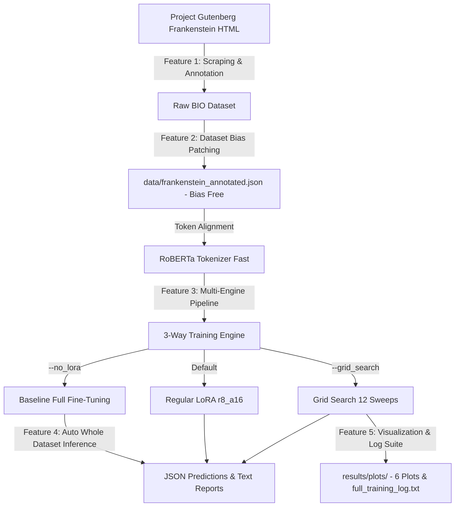

# Product Requirement Document (PRD)

**Project Title:** Parameter-Efficient Domain Adaptation & Annotation Framework for Literary Named Entity Recognition (NER)  
**Document Version:** 3.0 (Final Implemented Version)  
**Author:** Difa Dlyaul Haq (NIM: 22.61.0234)  
**Institution:** Fakultas Ilmu Komputer, Universitas Amikom Yogyakarta  
**Date:** July 2026  

---

## 1. Executive Summary & Objective

### 1.1 Background
General pre-trained language models (such as RoBERTa-base) suffer from significant performance degradation (*domain shift*) when extracting entities from specialized literary domains like 19th-century classic literature. The text of Mary Shelley’s novel *Frankenstein* features highly ambiguous naming conventions (e.g., non-lexical person names like *"the monster"*, *"the creature"*, or *"the fiend"* acting as `PERSON`) and complex descriptive phrasing. 

Conventional full fine-tuning is computationally expensive, prone to overfitting in low-resource data scenarios, and risks *catastrophic forgetting*. To resolve these issues, this project implements a multi-fold solution:
1. Building a dedicated **automated data scraping, annotation, and label-bias patching pipeline** to generate a high-quality, bias-free literary corpus.
2. Building a **Parameter-Efficient Fine-Tuning (PEFT) framework** using the LoRA (Low-Rank Adaptation) algorithm on RoBERTa-base to identify 18 OntoNotes 5.0 entity classes under strict VRAM constraints.
3. Conducting a **3-Way Comparative Experiment** (Full Fine-Tuning Baseline vs. Regular LoRA vs. Best Grid Search LoRA) across linguistic, computational, and hidden entity metrics.

### 1.2 Core Objectives
* **Data Scraping & Annotation:** Extract raw text from Project Gutenberg and automate the conversion into a tokenized sequence labeled in BIO format mapped to 18 OntoNotes 5.0 classes.
* **Dataset Label Bias Patching:** Automatically scan and correct label bias for 154 literary character pseudonyms (*monster, creature, wretch, fiend, demon, creator*) from `O` to `PERSON`.
* **Hyperparameter Tuning:** Automate a systematic Grid Search sweep over 12 combinations of LoRA Rank ($r \in [4, 8, 16, 32]$) and Alpha ($\alpha \in [16, 32, 64]$) parameters to find the optimal configuration.
* **3-Way Comparative Framework:** Compare Full Fine-Tuning (FFT) baseline with Regular LoRA ($r=8, \alpha=16$) and Best LoRA ($r=8, \alpha=64$).
* **Multidimensional Analysis & Visualization:** Evaluate classification performance using macro linguistic metrics, computational VRAM/time efficiency, MUC-5 error classifications, fine-grained entity attributes, hidden entity recall rates, and automatically generated 6-plot comparison suites.

---

## 2. Product Features & Functional Requirements

### 2.1 Feature 1: Data Scraping & Annotation Engine (`src/scrape_gutenberg.py` & `src/annotate_data.py`)
* **Scraping Requirement:** Automated extraction of clean chapter titles and text content from the English version of Project Gutenberg's *Frankenstein* HTML.
* **BIO Tagging Requirement:** Parse sentences and align word tokens with BIO tagging annotations mapped to 18 OntoNotes 5.0 categories using `tner/bert-base-ontonotes5`.
* **Tokenizer Integration:** Preprocess text with `RobertaTokenizerFast` utilizing prefix spacing and token alignment to ensure subwords are correctly mapped to their corresponding BIO tag (ignoring subwords using `-100`).

### 2.2 Feature 2: Dataset Label Bias Patching Engine (`scratch/patch_dataset.py`)
* **Bias Detection:** Scan the raw annotated corpus for common literary pseudonyms (*monster, creature, wretch, fiend, demon, creator*) that were mistagged as common nouns (`O`) by standard pre-trained models.
* **Explicit Tagging Correction:** Relabel all 154 occurrences explicitly to `B-PERSON` / `I-PERSON`, generating `data/frankenstein_annotated.json` to allow pure ML training without dataset bias.

### 2.3 Feature 3: Parameter-Efficient Fine-Tuning & Multi-Engine Pipeline (`src/model.py` & `src/main.py`)
* **Weight Isolation & LoRA Matrix Injection:** Freeze all base parameters of `RoBERTa-base` and insert low-rank decomposition matrices ($A$ and $B$) into Query ($Q$) and Value ($V$) attention modules.
* **3-Way Execution Modes:**
  1. **Full Fine-Tuning Baseline Mode (`--no_lora`):** Train 100% of base model weights (124M parameters) with adaptive learning rate (`5e-5`).
  2. **Regular LoRA Mode (Default):** Train standard LoRA adaptor ($r=8, \alpha=16$) with learning rate (`5e-4`).
  3. **Grid Search Tuning Mode (`--grid_search`):** Automatically sweep 12 combinations over $r \in [4, 8, 16, 32]$ and $\alpha \in [16, 32, 64]$.

### 2.4 Feature 4: Automatic Post-Training Inference Engine (`src/predict.py`)
* **Dynamic Model Loading:** Detect model architecture automatically via `adapter_config.json` presence (loading PEFT LoRA adapters or standard Full FT weights).
* **Whole Dataset Prediction:** Predict labels across all 3.081 novel sentences at the end of any training run, saving outputs to dedicated JSON files (`baseline_no_lora_predictions.json`, `regular_lora_predictions.json`, `grid_search_best_predictions.json`).
* **Hidden Entity Text Reporting:** Calculate and output pure ML recall percentages for literary pseudonyms into dedicated text files (`*_hidden_entity_report.txt`).

### 2.5 Feature 5: Multidimensional Evaluation & Visualization Suite (`src/evaluate.py` & `src/visualize_results.py`)
* **Linguistic Metrics:** Precision, Recall, and F1-Score (Macro-averaged) using `seqeval`.
* **Infrastructure Profiling:** Track peak VRAM (GB) and training execution time (seconds) using PyTorch CUDA stats.
* **MUC-5 Error Analysis:** Classify predictions into COR (Correct), INC (Incorrect), MIS (Missing), and SPU (Spurious).
* **Fine-Grained Analysis:** 
  * `eLen` (Entity Length): Accuracies for Short (< 4 words) vs Long ($\ge$ 4 words).
  * `eCon` (Label Consistency): Accuracies for Consistent vs Inconsistent (ambiguous) contexts.
  * `eFre` (Entity Frequency): Accuracies for Few-Shot ($\le$ 2 occurrences) vs Many-Shot (> 2 occurrences).
* **6-Plot Analytical Visualization Suite:**
  1. `heatmap_rank_alpha_f1.png` - F1-score heatmap across $r$ and $\alpha$.
  2. `muc5_error_comparison.png` - MUC-5 error breakdown.
  3. `fine_grained_robustness_comparison.png` - Attribute resilience.
  4. `training_time_comparison.png` - Grid search time lines.
  5. `method_comparison_f1_hidden.png` - Comparative bar chart of F1 vs. Hidden Entity Recall across 3 methods.
  6. `method_comparison_time_vram.png` - Dual-axis chart of Training Time vs. Peak VRAM across 3 methods.
* **Log Reconstruction Script (`scratch/reconstruct_logs.py`):** Consolidate epoch-by-epoch training logs into `results/full_training_log.txt`.

---

## 3. Technical & Environmental Specifications

| Component | Implemented Specification | Description |
| :--- | :--- | :--- |
| **Operating System** | Microsoft Windows 11 64-bit | Local workstation environment |
| **Programming Language** | Python 3.9.6 | Core runtime environment |
| **Deep Learning Framework**| PyTorch & Hugging Face Transformers | Backend tensor computing and PLM loading |
| **PEFT Library** | Hugging Face PEFT | LoRA injection and weight freeze management |
| **Evaluation & Plotting** | seqeval, scikit-learn, matplotlib, seaborn | Metrics, MUC-5, attributes, and 6-plot graphics |
| **Target Hardware CPU** | Intel Core (~2.49 GHz) | Local model processing |
| **Target Hardware RAM** | 24 GB Physical Memory | Handling tokenization and training states |
| **Target Hardware GPU** | NVIDIA GeForce GTX 1650 (4 GB VRAM) | Target workstation GPU optimization |

---

## 4. Achieved Success Criteria & Key Performance Indicators (KPIs)

### 4.1 Linguistic & Domain Adaptation KPIs
* **Macro F1-Score Target:** Best LoRA ($r=8, \alpha=64$) achieved **0.7826** (78.26% F1-score), exceeding the target threshold of 0.75 and closing the gap to Full Fine-Tuning (83.89%) to within **5.63%**.
* **Hidden Entity Recall:** Achieved **94.16% Recall** (145/154 pseudonyms detected) on Best LoRA without rule-based post-processing, compared to 0.00% on Zero-Shot pre-trained models.

### 4.2 Infrastructure Efficiency KPIs
* **VRAM Efficiency:** Peak VRAM consumption achieved **1.236 GB** (1.24 GB) on LoRA, saving **47.56% VRAM** compared to Full Fine-Tuning (2.357 GB).
* **Training Time Efficiency:** LoRA reduced training time to **620.47 seconds** (10.3 minutes), achieving a **41.20% speedup** compared to Full Fine-Tuning (1055.24 seconds).
* **Parameter Savings:** Trainable parameters reduced to **294.912 parameters** (**0.237%** of total weights), saving 99.76% parameter updates.

### 4.3 Robustness KPIs
* **MUC-5 Error Reduction:** Best LoRA reduced Missing (MIS) errors from 94 to 56 (**40.42% reduction**) and Spurious (SPU) errors from 138 to 83 (**39.85% reduction**) compared to Regular LoRA.
* **Fine-Grained Resilience:** Achieved **0.7000** accuracy on `eLen_long` (outperforming Full FT's 0.6000), **0.8246** on `eCon_inconsistent`, and **0.7090** on `eFre_few_shot`.

---

## 5. Development Timeline & Sprint Status

* **Sprint 1 (Completed):** 
  * Implement Gutenberg English web scraper (`scrape_gutenberg.py`).
  * Automate raw text parsing into BIO formatted tokens (`annotate_data.py`).
  * Develop label bias patching script (`patch_dataset.py`).
* **Sprint 2 (Completed):** 
  * Develop LoRA PEFT engine and Full FT baseline engine (`model.py`, `main.py`).
  * Execute Grid Search automated runner over 12 combinations (`train.py`).
  * Integrate automatic post-training whole dataset prediction (`predict.py`).
* **Sprint 3 (Completed):** 
  * Develop MUC-5, fine-grained, and hidden entity evaluation modules (`evaluate.py`).
  * Implement 6-plot automated visualization suite (`visualize_results.py`).
  * Reconstruct consolidated step-by-step logs (`reconstruct_logs.py`).
  * Draft thesis Chapters 4 (Results & Discussion) and 5 (Conclusion) (`laporan_skripsi_bab4_bab5.md`).
