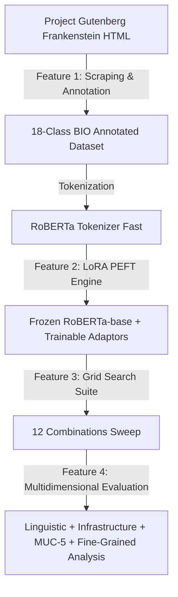

# Product Requirement Document (PRD)

**Project Title:** Parameter-Efficient Domain Adaptation & Annotation Framework for Literary Named Entity Recognition (NER)  
**Document Version:** 2.0 (Updated)  
**Author:** Difa Dlyaul Haq (NIM: 22.61.0234)  
**Institution:** Fakultas Ilmu Komputer, Universitas Amikom Yogyakarta  
**Date:** July 2026  

---

## 1. Executive Summary & Objective

### 1.1 Background
General pre-trained language models (such as RoBERTa-base) suffer from significant performance degradation (*domain shift*) when extracting entities from specialized literary domains like 19th-century classic literature. The text of Mary Shelley’s novel *Frankenstein* features highly ambiguous naming conventions (e.g., non-lexical person names like *"The Monster"*, *"The Creature"*, or *"The Fiend"* acting as `PERSON`) and complex descriptive phrasing. 

Conventional full fine-tuning is computationally expensive, prone to overfitting in low-resource data scenarios, and risks *catastrophic forgetting*. To resolve these issues, this project implements a two-fold solution:
1. Building a dedicated **automated data scraping & BIO annotation pipeline** to generate high-quality literary corpus.
2. Building a **Parameter-Efficient Fine-Tuning (PEFT) framework** using the LoRA (Low-Rank Adaptation) algorithm on RoBERTa-base to identify 18 OntoNotes 5.0 entity classes under strict VRAM constraints.

### 1.2 Core Objectives
* **Data Annotation:** Extract raw text from Project Gutenberg and automate the conversion into a tokenized sequence labeled in BIO (Beginning-Inside-Outside) format mapped to the 18 standard OntoNotes 5.0 classes.
* **Hyperparameter Tuning:** Automate a systematic Grid Search sweep over 12 combinations of LoRA Rank ($r$) and Alpha ($\alpha$) parameters to find the optimal configuration.
* **Multidimensional Analysis:** Evaluate and analyze the NER classification performance using holistic linguistic metrics, computational VRAM/time efficiency, MUC-5 error classifications, and fine-grained entity attributes (length, consistency, frequency).

---

## 2. Product Features & Functional Requirements

### 2.1 Feature 1: Data Scraping & Annotation Engine
* **Scraping Requirement:** Automated extraction of clean chapter titles and text content from the English version of Project Gutenberg's *Frankenstein* HTML.
* **BIO Tagging Requirement:** Parse sentences and align word tokens with BIO tagging annotations mapped to 18 OntoNotes 5.0 categories (with special attention to `PERSON` and `LOCATION`).
* **Tokenizer Integration:** Preprocess text with `RobertaTokenizerFast` utilizing prefix spacing and token alignment to ensure subwords are correctly mapped to their corresponding BIO tag (ignoring subwords using `-100`).

### 2.2 Feature 2: Parameter-Efficient Fine-Tuning (PEFT) Engine
* **Weight Isolation:** Freeze all base parameters of the pre-trained `RoBERTa-base` model.
* **LoRA Matrix Injection:** Insert low-rank decomposition matrices ($A$ and $B$) into the Query ($Q$) and Value ($V$) modules of the multi-head self-attention layers.
* **Trainable Parameter Reduction:** Bound trainable parameters to $< 1.0\%$ of the total model weights to prevent overfitting on low-resource literary text.

### 2.3 Feature 3: Grid Search Automated Tuning Suite
* **Grid Sweep Configuration:** Support automated training of 12 distinct configurations over the parameter matrix:
  * **Rank ($r$):** `[4, 8, 16, 32]`
  * **Alpha ($\alpha$):** `[16, 32, 64]`
* **Customization:** Respect standard CLI arguments for training parameters (epochs, batch size, learning rate) inside the grid search loops to allow fast verification runs.
* **Resource Cleanup:** Enforce explicit memory garbage collection and CUDA cache clearing after each sweep iteration to prevent memory leaks during long runs.

### 2.4 Feature 4: Evaluation & Analysis Suite
The system must compile and save evaluation reports for both single runs and grid search sweeps. The metrics must cover:
* **Linguistic Metrics:** Precision, Recall, and F1-Score (Macro-averaged) using the `seqeval` library.
* **MUC-5 Error Analysis:** Classification of predicted token boundaries into COR (Correct), INC (Incorrect), MIS (Missing), and SPU (Spurious) to debug model hallucinations and omissions.
* **Fine-Grained Analysis:** 
  * `eLen` (Entity Length): Accuracies for Short (< 4 words) vs Long ($\ge$ 4 words) entities.
  * `eCon` (Label Consistency): Accuracies for Consistent vs Inconsistent (ambiguous) name contexts.
  * `eFre` (Entity Frequency): Accuracies for Few-Shot ($\le$ 2 occurrences) vs Many-Shot (> 2 occurrences) tokens.

---

## 3. Technical & Environmental Specifications

| Component | Minimum Specification | Description |
| :--- | :--- | :--- |
| **Operating System** | Microsoft Windows 11 64-bit | Local workstation environment |
| **Programming Language** | Python 3.9.6 | Core runtime environment |
| **Deep Learning Framework**| PyTorch & Hugging Face Transformers | Backend tensor computing and PLM loading |
| **PEFT Library** | Hugging Face PEFT | LoRA injection and weight freeze management |
| **Evaluation Libraries** | seqeval, scikit-learn | Calculations of macro metrics, MUC-5, and attributes |
| **Target Hardware CPU** | Intel Core (~2.49 GHz) | Local model processing |
| **Target Hardware RAM** | 24 GB Physical Memory | Safe handling of tokenization and training states |
| **Target Hardware GPU** | NVIDIA GeForce GTX 1650 (4 GB VRAM) | Target consumer-grade hardware optimization |

---

## 4. Success Criteria & Key Performance Indicators (KPIs)

### 4.1 Linguistic Targets
* **Goal:** The best LoRA model ($r=16, \alpha=64$) must maintain or exceed an overall Macro F1-score of **0.75** on the validation set.
* **Linguistic Robustness:** Accurately extract atypical characters (e.g., *"The Monster"*) under the `PERSON` label.

### 4.2 Infrastructure Targets
* **VRAM Efficiency:** Peak VRAM consumption must remain under **3.5 GB** during training, allowing execution on the GTX 1650 4GB GPU without Out-Of-Memory (OOM) errors.
* **Parameter Savings:** Trainable parameters must not exceed **1.0%** of total weights (approx. 1.2M parameters out of 125M total).

### 4.3 Error Classification & Robustness Targets
* **MUC-5 Error Bounds:** Reduce MIS (Missing) errors by at least 25% and SPU (Spurious) errors by at least 20% on the optimal model compared to the baseline ($r=8, \alpha=16$).
* **Fine-Grained Robustness:** Keep eLen Long accuracy above **0.75** and eCon Inconsistent accuracy above **0.80**, demonstrating high resilience against ambiguous contexts and long descriptive phrases.

---

## 5. Development Timeline & Sprints

* **Sprint 1 (Completed):** 
  * Implement Gutenberg English web scraper.
  * Automate raw text parsing into BIO formatted tokens.
  * Establish baseline RoBERTa tokenizer integration.
* **Sprint 2 (Completed):** 
  * Develop the LoRA PEFT training module.
  * Implement and execute the Grid Search automated runner over 12 combinations.
  * Save results to `grid_search_results.csv` and compile full logs.
* **Sprint 3 (Current):** 
  * Conduct MUC-5 error analysis and interpretative fine-grained analysis.
  * Analyze grid search output logs.
  * Draft thesis Chapters 4 (Results & Discussion) and 5 (Conclusion).
