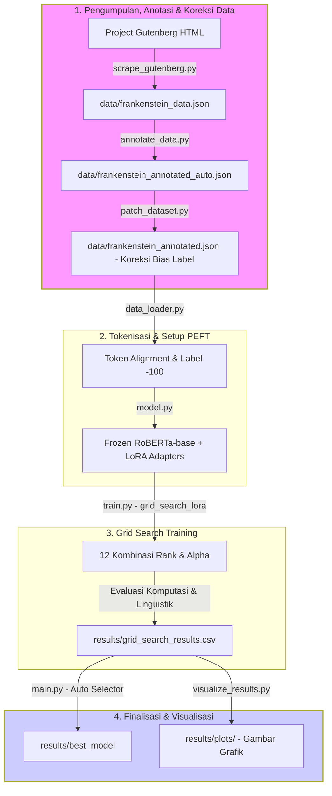

# Evaluasi Parameter-Efficient Fine-Tuning (LoRA) pada Model RoBERTa untuk Named Entity Recognition di Domain Sastra Low-Resource

Repositori ini berisi kode dan metodologi eksperimen untuk penelitian evaluasi kinerja model bahasa pra-terlatih (RoBERTa) menggunakan teknik *Low-Rank Adaptation* (LoRA) pada tugas *Named Entity Recognition* (NER). Penelitian ini secara khusus menangani tantangan *domain shift* dan keterbatasan data (*low-resource*) pada teks sastra klasik berbahasa Inggris (novel *Frankenstein*).

## Deskripsi Proyek
Ekstraksi informasi pada teks sastra menghadapi tantangan besar akibat ambiguitas semantik, gaya bahasa kiasan (personifikasi), dan ketiadaan korpus beranotasi yang memadai. Proyek ini mengevaluasi sejauh mana implementasi LoRA pada arsitektur RoBERTa mampu menekan beban komputasi (VRAM) sekaligus bertindak sebagai agen regularisasi intrinsik untuk mencegah *overfitting*, sambil tetap mempertahankan akurasi klasifikasi 18 kelas entitas berdasarkan standar **OntoNotes 5.0**.

## Fitur Utama & Metodologi
* **Model Arsitektur:** RoBERTa (*Robustly Optimized BERT Pretraining Approach*).
* **Teknik Optimasi:** *Parameter-Efficient Fine-Tuning* (PEFT) menggunakan **LoRA**. Pembaruan bobot ($\Delta W = BA$) dibatasi melalui dekomposisi matriks berdimensi rendah untuk mengendalikan derajat kebebasan model.
* **Hyperparameter Tuning:** Menggunakan metode **Grid Search** untuk memetakan kombinasi optimal antara dimensi *Rank* (`r`) dan faktor skala *Alpha* (`alpha`).
* **Dataset Target:** Korpus *low-resource* dari novel *Frankenstein*, dianotasi dalam format BIO (*Beginning, Inside, Outside*).

## Metrik Evaluasi
Kinerja model diuji secara komprehensif menggunakan empat kelompok parameter evaluasi:

1. **Kinerja Linguistik:**
   * Precision, Recall, dan F1-Score (Macro-average).
2. **Kinerja Infrastruktur Komputasi:**
   * Alokasi memori grafis / VRAM maksimal (GB).
   * Waktu komputasi / *Execution Time* (detik/menit).
3. **Analisis Galat (MUC-5 Adaptation):**
   * **COR (Correct):** Entitas dilabeli dengan tepat.
   * **INC (Incorrect):** Kesalahan klasifikasi kelas (*Substitution*).
   * **MIS (Missing):** Gagal mengekstraksi entitas (*Undergeneration*).
   * **SPU (Spurious):** Halusinasi pengekstraksian token non-entitas (*Overgeneration*).
4. **Fine-Grained Analysis (Atribut Entitas):**
   * `eLen` (Entity Length): Ketahanan terhadap frasa entitas panjang ($\ge$ 4 kata).
   * `eCon` (Label Consistency): Penanganan ambiguitas kelas token.
   * `eFre` (Entity Frequency): Kinerja pada entitas *few-shot/zero-shot*.

## Teknologi & Dependensi
Eksperimen ini dibangun menggunakan ekosistem Python dengan pustaka utama berikut:
* `Python` >= 3.8
* `PyTorch` (Backend Komputasi Tensors)
* `Transformers` (Hugging Face - Inisialisasi RoBERTa)
* `PEFT` (Hugging Face - Injeksi LoRA)
* `Datasets` & `Tokenizers`
* `scikit-learn` & `seqeval` (Kalkulasi Metrik Evaluasi)

## 🔄 Alur Eksekusi Program (Detail Workflow)

Program ini bekerja melalui empat tahap utama, dari pengolahan teks novel mentah hingga menghasilkan model terbaik beserta grafik analisis evaluasinya. Berikut adalah diagram alur program:



### Penjelasan Detail Tiap Tahap:

1. **Tahap 1: Pengumpulan, Anotasi & Koreksi Data (`scrape_gutenberg.py`, `annotate_data.py` & `patch_dataset.py`)**
   * **Scraping:** Program mengunduh teks novel *Frankenstein* versi bahasa Inggris dari Project Gutenberg, membersihkan elemen HTML, memilah struktur bab, dan menyimpannya ke berkas JSON mentah.
   * **Anotasi Otomatis:** Teks mentah dipecah menjadi kalimat dan kata (*tokens*). Setiap token dipindai menggunakan model NER pra-terlatih berbasis standar OntoNotes 5.0 untuk mendeteksi entitas nama secara otomatis (misal: mengidentifikasi tokoh "*The Monster*" sebagai `PERSON`) dan menghasilkan berkas anotasi dalam format BIO.
   * **Koreksi Bias Label:** Data anotasi mentah disaring kembali menggunakan skrip pembersih dataset untuk secara eksplisit melabeli kata benda penunjuk karakter (*monster, creature, wretch, fiend, creator*) yang tadinya terlewat/salah diberi label `"O"` di kunci jawaban aslinya, menjadi `"B-PERSON"` / `"I-PERSON"`. Ini bertujuan melatih model secara murni tanpa bias data latih.

2. **Tahap 2: Tokenisasi & Setup PEFT (`data_loader.py` & `model.py`)**
   * **Token Alignment:** Token kata diubah menjadi ID angka menggunakan tokenizer cepat RoBERTa (`RobertaTokenizerFast`). Karena tokenizer ini memecah beberapa kata menjadi subwords (suku kata pecahan), program menyelaraskan label BIO agar pecahan kata tersebut diberi label `-100` (agar diabaikan selama proses perhitungan performa klasifikasi).
   * **Injeksi LoRA:** Model dasar `roberta-base` dimuat. Seluruh parameter aslinya dibekukan (*frozen*), lalu matriks dekomposisi dimensi rendah ($A$ dan $B$) disisipkan secara khusus ke lapisan perhatian (*Query* dan *Value* pada lapisan *attention*).

3. **Tahap 3: Pelatihan & Tuning Hyperparameter (`train.py` & `main.py`)**
   * **Iterasi Grid Search:** Program secara otomatis melakukan pelatihan berulang untuk menyisir 12 kombinasi hyperparameter Rank ($r \in [4, 8, 16, 32]$) dan Alpha ($\alpha \in [16, 32, 64]$).
   * **Pengukuran Kinerja:** Selama proses latihan berjalan, sistem memantau durasi waktu komputasi serta alokasi memori grafis (VRAM) puncak. Di akhir setiap epoch kombinasi, model diuji pada data evaluasi untuk mengukur F1-Score, Precision, dan Recall. Seluruh rekapitulasi data disimpan ke `grid_search_results.csv`.

4. **Tahap 4: Finalisasi & Visualisasi (`main.py` & `visualize_results.py`)**
   * **Penentu Model Terbaik:** Program secara otomatis membaca berkas CSV hasil *grid search*, mendeteksi kombinasi dengan F1-score tertinggi, mencetak ringkasannya di terminal, dan menyalin berkas bobot model terbaik tersebut ke folder khusus `results/best_model/`.
   * **Pembuatan Grafik:** Program membaca CSV hasil untuk memplot grafik heatmap F1-score, perbandingan kesalahan MUC-5 (CORR, INC, MIS, SPU), ketahanan model terhadap atribut khusus, dan perbandingan waktu latih untuk mempermudah analisis laporan hasil penelitian.

## Struktur Repositori
```text
├── data/                  # Korpus teks mentah dan dataset beranotasi (Frankenstein)
├── notebooks/             # Eksperimen interaktif (Jupyter Notebook / Colab)
├── scratch/
│   └── patch_dataset.py   # Script pembersih & koreksi bias label dataset
├── src/
│   ├── scrape_gutenberg.py # Script pengunduh & ekstraktor teks novel mentah dari Gutenberg
│   ├── data_loader.py     # Script pra-pemrosesan dan tokenisasi BIO
│   ├── model.py           # Konfigurasi RoBERTa dan integrasi LoRA
│   ├── train.py           # Pipeline Grid Search dan Fine-tuning
│   ├── evaluate.py        # Modul kalkulasi metrik (Linguistik, Komputasi, MUC-5, Fine-grained)
│   ├── annotate_data.py   # Script pelabelan data mentah otomatis menggunakan pre-trained model
│   ├── visualize_results.py # Script pembuat grafik visualisasi analisis hasil
│   ├── predict.py         # Script inferensi / pelabelan kalimat baru pasca-training dengan model terbaik
│   └── main.py            # Script utama orkestrator CLI pipeline
├── requirements.txt       # Daftar dependensi Python
└── README.md              # Dokumentasi proyek
```

## Cara Menjalankan via CMD / Terminal

Ikuti langkah-langkah di bawah ini untuk menjalankan alur eksperimen komplit dari awal:

### 1. Instalasi Dependensi
Pastikan Python ($\ge$ 3.8) sudah terinstal, kemudian jalankan perintah berikut untuk menginstal seluruh pustaka yang diperlukan:
```cmd
pip install -r requirements.txt
```

### 2. Pengunduhan & Ekstraksi Novel Mentah
Mengunduh teks novel *Frankenstein* versi HTML secara otomatis dari Project Gutenberg dan mengekstraknya menjadi teks mentah per bab:
```cmd
python src/scrape_gutenberg.py
```
*Catatan: Berkas hasil ekstraksi teks mentah akan disimpan di `data/frankenstein_data.json`.*

### 3. Pra-pemrosesan & Anotasi BIO Otomatis
Melabeli teks novel mentah secara otomatis menggunakan model bahasa pra-terlatih untuk diubah menjadi dataset berformat BIO:
```cmd
python src/annotate_data.py
```
*Catatan: Berkas anotasi hasil proses ini akan disimpan di `data/frankenstein_annotated_auto.json`.*

### 4. Koreksi Bias Label Dataset (Krusial untuk Hidden Entities)
Membersihkan data anotasi dan secara eksplisit melabeli kata benda penunjuk karakter sastra yang terlewat oleh model standar menjadi entitas `PERSON`:
```cmd
python scratch/patch_dataset.py
```
*Catatan: Berkas `data/frankenstein_annotated.json` akan otomatis dikoreksi dan siap digunakan sebagai data latih yang bebas bias.*

### 5. Jalankan Fine-Tuning Standar
Menjalankan training standar menggunakan konfigurasi bawaan LoRA ($r=8$, $\alpha=16$) dan langsung mengevaluasi model pada data uji (menyimpan laporan lengkap hasil ke format JSON):
```cmd
python src/main.py --data_path data/frankenstein_annotated.json --output_dir ./results --epochs 3 --batch_size 8
```

### 6. Jalankan Hyperparameter Tuning (Grid Search)
Menyisir performa kombinasi Rank ($r \in [4, 8, 16, 32]$) dan Alpha ($\alpha \in [16, 32, 64]$) guna memetakan performa terbaik (F1-score), melacak beban VRAM/waktu latih, dan menyalin model terbaik secara otomatis ke folder `./results/best_model`:
```cmd
python src/main.py --data_path data/frankenstein_annotated.json --output_dir ./results --grid_search
```

### 7. Menghasilkan Grafik Analisis Hasil (Visualisasi)
Memplot seluruh metrik hasil eksperimen grid search (menghasilkan diagram *heatmap* F1-score, perbandingan galat MUC-5, ketahanan atribut *fine-grained*, dan garis efisiensi waktu) ke dalam folder `results/plots/`:
```cmd
python src/visualize_results.py
```

### 8. Inferensi / Pelabelan Teks Baru (Pasca-Training)
* **Untuk melabeli satu kalimat tunggal:**
  Menggunakan model terbaik yang sudah dilatih (disimpan di `results/best_model`) untuk memprediksi dan melabeli entitas pada kalimat baru:
  ```cmd
  python src/predict.py --text "I saw Victor Frankenstein and the Monster in Geneva."
  ```
  *Catatan: Anda dapat mengganti isi teks di dalam tanda kutip dengan kalimat apa pun yang ingin Anda prediksi.*

* **Untuk melabeli seluruh dataset sekaligus (Whole Dataset Inference):**
  Menggunakan model terbaik untuk memprediksi label untuk seluruh kumpulan data sekaligus dan menyimpannya ke berkas JSON (sangat cepat, sekitar 1-2 menit untuk seluruh data tes):
  ```cmd
  python src/predict.py --data_path data/frankenstein_annotated.json --output_path results/whole_dataset_predictions.json
  ```
  *Catatan: Berkas hasil keluaran prediksi dataset lengkap akan disimpan di `results/whole_dataset_predictions.json`.*


### Referensi Parameter CLI (CMD Arguments)
Anda dapat menyesuaikan parameter eksekusi dengan menambahkan argumen berikut saat menjalankan script:

| Parameter | Tipe | Nilai Bawaan (Default) | Penjelasan |
| :--- | :--- | :--- | :--- |
| `--data_path` | `str` | `data/frankenstein_annotated.json` | Lokasi file dataset berformat BIO JSON/JSONL/CSV. |
| `--model_name` | `str` | `roberta-base` | Model pre-trained checkpoint dari Hugging Face. |
| `--output_dir` | `str` | `./results` | Folder tempat penyimpanan model terbaik dan file hasil evaluasi. |
| `--grid_search` | `flag` | - | Mengaktifkan sweep parameter LoRA rank dan alpha (menyimpan hasil ke `grid_search_results.csv` dan model terbaik ke `best_model/`). |
| `--epochs` | `int` | `3` | Jumlah siklus pelatihan (berlaku untuk training standar maupun per kombinasi grid search). |
| `--batch_size` | `int` | `8` | Ukuran batch pelatihan untuk input tensor. |
| `--learning_rate`| `float`| `5e-4` | Learning rate yang dioptimalkan untuk LoRA adapter. |

Contoh perintah dengan parameter kustom:
```cmd
python src/main.py --data_path data/frankenstein_annotated.json --epochs 5 --batch_size 16 --learning_rate 3e-4 --output_dir ./custom_results
```

