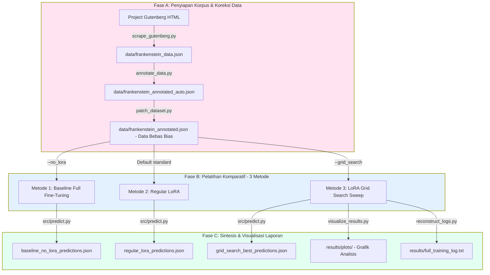

# LoRA-RoBERTa Token Classification Pipeline (NER Novel Frankenstein)

Proyek ini merupakan repositori eksperimen ilmiah untuk meneliti **Pengaruh Hyperparameter LoRA (Low-Rank Adaptation) terhadap Kinerja Model RoBERTa** pada tugas *Named Entity Recognition* (NER) bersumber daya rendah (*low-resource*) menggunakan novel klasik *Frankenstein* karya Mary Shelley. 

Fokus utama penelitian ini adalah mengukur kemampuan model dalam mengenali **Entitas Tersembunyi Sastra (*Literary Hidden Entities*)**—kata benda umum penunjuk tokoh utama seperti *monster, creature, wretch, fiend, demon, creator*—yang secara konvensional sering terlewatkan (dilabeli `O`) oleh model NER standar.

---

## Alur Eksperimen (Experimental Workflow)

Sistem bekerja secara otomatis melalui alur kerja berurutan dari ekstraksi data hingga komparasi hasil:



---

## Alur Strategis Eksekusi Eksperimen (Execution Roadmap)

Untuk mempermudah pengumpulan data Bab IV Skripsi Anda, ikuti urutan eksekusi taktis berikut secara berturut-turut di terminal/CMD:

### FASE A: Penyiapan Korpus & Koreksi Dataset
1. **Instalasi Pustaka:**
   ```cmd
   pip install -r requirements.txt
   ```
2. **Scraping Teks Novel:**
   ```cmd
   python src/scrape_gutenberg.py
   ```
3. **Pelabelan Awal Otomatis (OntoNotes 5.0):**
   ```cmd
   python src/annotate_data.py
   ```
4. **Koreksi Bias Label (Hidden Entities):**
   ```cmd
   python scratch/patch_dataset.py
   ```

### FASE B: Pelatihan & Pengujian (Tiga Metode Utama)
Jalankan ketiga eksperimen berikut untuk mengumpulkan data komparatif:
* **Metode 1: Baseline (Full Fine-Tuning / Tanpa LoRA)**
  ```cmd
  python src/main.py --data_path data/frankenstein_annotated.json --output_dir ./results --no_lora --epochs 3 --batch_size 8
  ```
* **Metode 2: Regular LoRA ($r=8, \alpha=16$)**
  ```cmd
  python src/main.py --data_path data/frankenstein_annotated.json --output_dir ./results --epochs 3 --batch_size 8
  ```
* **Metode 3: LoRA Hyperparameter Tuning (Grid Search Sweep)**
  ```cmd
  python src/main.py --data_path data/frankenstein_annotated.json --output_dir ./results --grid_search
  ```

### FASE C: Visualisasi & Evaluasi Akhir
* **Pembuatan Grafik Plots (Termasuk Grafik Komparatif 3 Metode):**
  ```cmd
  python src/visualize_results.py
  ```
* **Penyusunan Log Latih Gabungan (Baseline FFT + Regular LoRA + Grid Search):**
  ```cmd
  python scratch/reconstruct_logs.py
  ```
* **Pengujian & Inferensi Model secara Manual (Opsional):**
  Meskipun prediksi seluruh dataset novel berjalan secara otomatis di akhir pelatihan `src/main.py` (menghasilkan file `.json` prediksi), Anda dapat menjalankan pengujian kustom secara manual:
  * Menguji kalimat tunggal secara langsung:
    ```cmd
    python src/predict.py --text "I saw Victor Frankenstein and the Monster in Geneva."
    ```
  * Menjalankan ulang prediksi untuk seluruh dataset secara manual:
    ```cmd
    python src/predict.py --data_path data/frankenstein_annotated.json
    ```

---

## Penjelasan Langkah Demi Langkah & Output Detail

### 1. Scraping Novel (`src/scrape_gutenberg.py`)
Mengunduh novel *Frankenstein* versi HTML Project Gutenberg, membersihkan tag HTML, mengekstrak teks mentah per bab, dan menyimpannya ke `data/frankenstein_data.json`.

### 2. Anotasi Otomatis (`src/annotate_data.py`)
Menggunakan model besar `tner/bert-base-ontonotes5` untuk melabeli teks mentah secara otomatis ke dalam tag BIO. Hasil disimpan di `data/frankenstein_annotated_auto.json`.

### 3. Koreksi Dataset (`scratch/patch_dataset.py`)
Mengoreksi bias label pada dataset mentah. Sebanyak **154 kata kunci penunjuk tokoh** (*monster, creature, wretch, fiend, demon, creator*) yang tadinya salah dilabeli sebagai `O` dikoreksi menjadi `B-PERSON` / `I-PERSON`. File bebas bias disimpan di `data/frankenstein_annotated.json`.

### 4. Pelatihan Model (`src/main.py` & `src/train.py`)
Merupakan orkestrator utama pelatihan. Secara cerdas mendeteksi ketersediaan GPU (NVIDIA CUDA) untuk akselerasi pelatihan.
* **Bila `--no_lora` aktif:** Melatih seluruh bobot model dengan Full Fine-Tuning. Menyimpan metrik ringkasan ke `results/standard_no_lora_results.csv`, laporan ke `results/evaluation_report_no_lora.json`, dan otomatis memprediksi novel ke `results/baseline_no_lora_predictions.json` (serta mencetak laporan deteksi hidden entity).
* **Bila LoRA aktif:** Hanya melatih adaptor LoRA pada Query & Value attention. Menyimpan ringkasan ke `results/standard_lora_results.csv`, laporan ke `results/evaluation_report.json`, dan prediksi novel ke `results/regular_lora_predictions.json`.
* **Bila `--grid_search` aktif:** Menyisir 12 kombinasi Rank ($r$) & Alpha ($\alpha$). Menyimpan rekap ke `results/grid_search_results.csv`, otomatis menyalin model terbaik ke `results/best_model/`, dan memprediksi novel ke `results/grid_search_best_predictions.json`.

### 5. Visualisasi Hasil (`src/visualize_results.py`)
Membaca berkas hasil CSV dari ketiga metode untuk diplot menjadi **6 grafik analitis** di folder `results/plots/`:
1. `heatmap_rank_alpha_f1.png` - Efek kombinasi $r$ dan $\alpha$ pada F1-score (Grid Search).
2. `muc5_error_comparison.png` - Grafik perbandingan tipe galat batas entitas (Grid Search).
3. `fine_grained_robustness_comparison.png` - Ketahanan model pada kategori eLen, eCon, dan eFre (Grid Search).
4. `training_time_comparison.png` - Perbandingan garis waktu latih di GPU (Grid Search).
5. `method_comparison_f1_hidden.png` - Grafik batang komparatif F1-Score vs Hidden Entity Recall antara Baseline, Regular LoRA, dan Best LoRA (Baru!).
6. `method_comparison_time_vram.png` - Perbandingan efisiensi daya komputasi (Waktu Latih vs Peak VRAM) antara Baseline, Regular LoRA, dan Best LoRA (Baru!).

### 6. Inferensi & Koreksi Label BIO (`src/predict.py`)
Digunakan untuk melakukan inferensi prediksi tag NER baik pada satu kalimat tunggal (`--text`) maupun pada keseluruhan dataset (`--data_path`).

Dalam prosesnya, script ini mengimplementasikan metode **Hybrid (Deep Learning + Rule-Based)** untuk mengoreksi anomali format penulisan tag BIO:
* **Deep Learning (RoBERTa-LoRA):** Memprediksi probabilitas kelas token secara cerdas dan kontekstual.
* **Rule-Based Post-Processing (`post_process_bio_tags`):** Karena klasifikasi model dilakukan per token secara independen (tanpa layer CRF), model mentah terkadang memprediksi urutan BIO yang tidak valid—seperti mendeteksi nama gabungan *"Victor Frankenstein"* sebagai `B-PERSON` diikuti `B-PERSON` (akibat bias kata *"Frankenstein"* yang sering berdiri sendiri sebagai `B-PERSON` di data latih). Aturan heuristik pasca-prediksi ini otomatis mendeteksi ketidaksesuaian transisi tersebut dan merapikannya ke format BIO yang valid (`B-PERSON` -> `I-PERSON`).

**Contoh Perbandingan Output Inferensi:**
* **Input:** `I saw Victor Frankenstein and the Monster in Geneva.`
* **Raw Model Output:**
  ```text
  Victor               -> B-PERSON
  Frankenstein         -> B-PERSON
  the                  -> B-PERSON
  Monster              -> B-PERSON
  ```
* **Post-Processed Output (Valid BIO):**
  ```text
  Victor               -> B-PERSON
  Frankenstein         -> I-PERSON
  the                  -> B-PERSON
  Monster              -> I-PERSON
  ```

---

## Panduan Struktur Repositori untuk Studi Kode

Untuk mempermudah mempelajari kode sumber proyek ini, berikut adalah kegunaan masing-masing berkas penting:

```text
├── data/
│   ├── frankenstein_data.json         # Teks mentah per bab novel hasil scraping
│   ├── frankenstein_annotated_auto.json# Hasil anotasi otomatis mentah (masih bias)
│   └── frankenstein_annotated.json    # Dataset final yang sudah dikoreksi (Bebas bias)
├── scratch/
│   └── patch_dataset.py               # Algoritma pembersih bias pelabelan token sastra
├── src/
│   ├── scrape_gutenberg.py            # Logika web-scraping & parsing bab novel
│   ├── annotate_data.py               # Pipeline anotasi dengan pre-trained BERT OntoNotes
│   ├── data_loader.py                 # Tokenizer RoBERTa & alignment subwords (label -100)
│   ├── model.py                       # Konfigurasi pembekuan model dasar & injeksi PEFT LoRA
│   ├── train.py                       # Prosedur pelatihan & grid search sweep
│   ├── evaluate.py                    # Kalkulator metrik MUC-5, Fine-Grained, & Hidden Entities
│   ├── visualize_results.py           # Logika plotting matplotlib & seaborn
│   ├── predict.py                     # Script evaluasi whole dataset & inferensi kalimat tunggal
│   └── main.py                        # CLI orkestrator & auto-selector model terbaik
├── requirements.txt                   # Daftar dependensi modul Python
└── README.md                          # Dokumentasi panduan proyek
```

---

## Metrik Evaluasi Ilmiah yang Digunakan

Proyek ini mengevaluasi kinerja model berdasarkan empat pilar evaluasi untuk bab pembahasan skripsi:
1. **Linguistic Metrics:** Precision, Recall, dan F1-Score tingkat makro (menggunakan `seqeval`).
2. **MUC-5 Error Classification:** Memilah kecocokan batas entitas menjadi **COR** (tepat), **INC** (salah tipe), **MIS** (terlewat), dan **SPU** (halusinasi).
3. **Fine-Grained Analysis:** Menguji ketahanan model pada sub-kategori:
   * `eLen_short`/`eLen_long`: Panjang kata entitas.
   * `eCon_consistent`/`eCon_inconsistent`: Konsistensi penulisan label di teks.
   * `eFre_few_shot`/`eFre_many_shot`: Frekuensi kemunculan entitas di novel.
4. **Computing Performance:** Mencatat secara presisi **Durasi Waktu Pelatihan (Detik)** dan **Beban Peak VRAM GPU (GB)** menggunakan pustaka PyTorch CUDA.
5. **Hidden Entity Recall:** Mengukur secara mutlak persentase penemuan kembali kata sandang sastra berhuruf kecil yang bertindak sebagai entitas di dalam novel.


